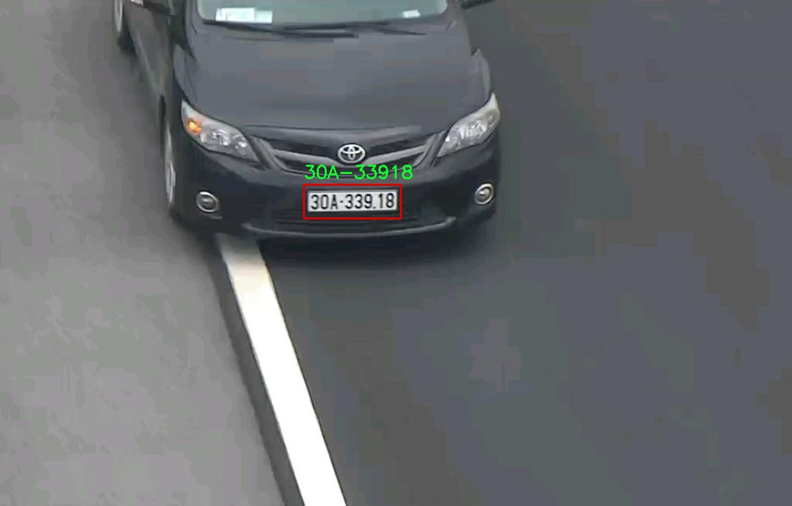
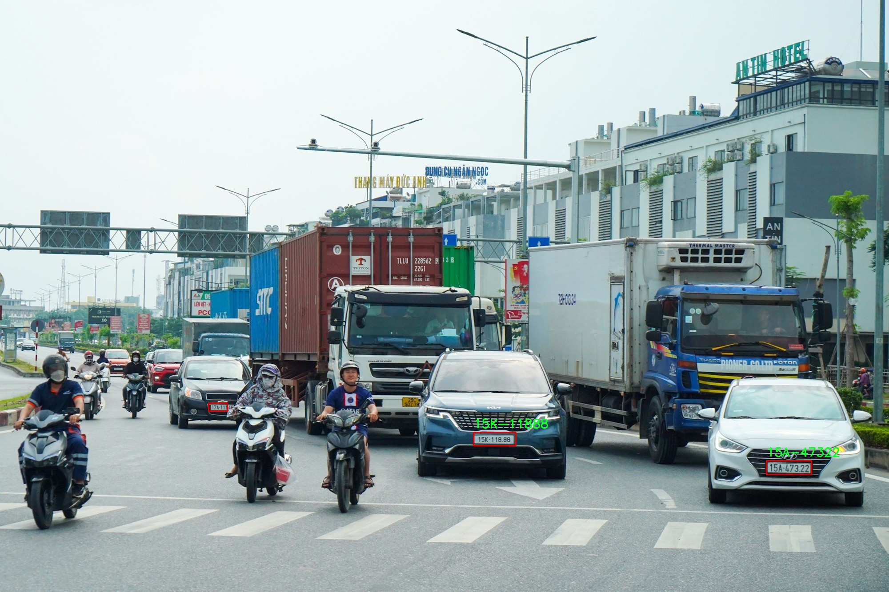

# VN License Plate Recognition

## Installation
- this project using python==3.8.20
```bash
  # install env and libraries using conda
  conda create --prefix env python==3.8.20
  conda activate ./env
  pip install -r requirements.txt
```

- **Pretrained model** provided in ./model folder in this repo 

- Yolov5 old version is available in project folder

## Run License Plate Recognition

```bash
  # run inference on webcam
  python webcam.py 

  # run inference on image
  python image.py -i test_image/3.jpg
```

## Result



