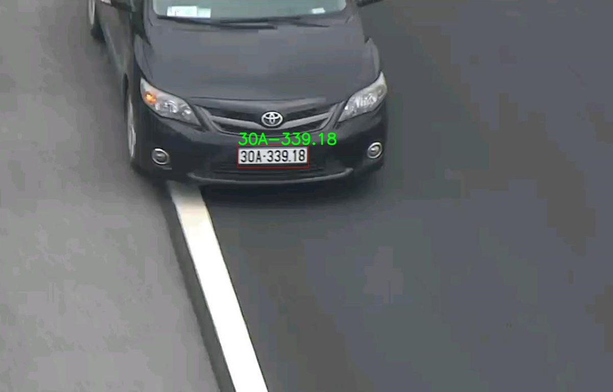

# VN License Plate Recognition

## Installation
- this project using python==3.8.20 + Yolov5 + ppOCRv4-EN
```bash
  # install env and libraries using conda
  conda create --prefix env python==3.8.20
  conda activate ./env
  pip install -r requirements.txt
```

- **Pretrained model** provided in ./weights folder in this repo 


## Run License Plate Recognition

```bash
  # run inference on webcam
  python camera.py 

  # run inference on image
  python image.py
```

## Result



